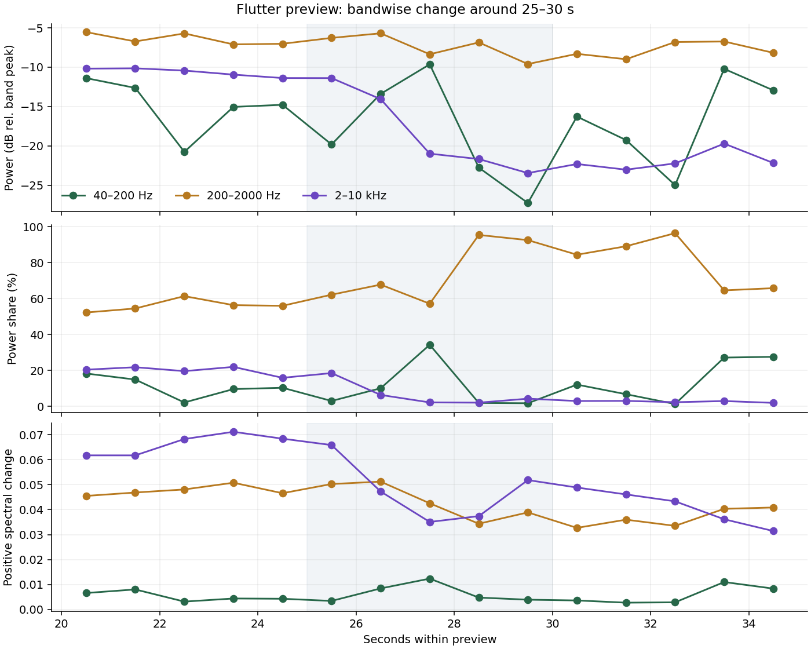

# Flutter：25〜30秒の変化を帯域別に分ける

2026-10-02 JST。Autechre研究の非Canonチェックポイント。製品コード・main・integrationは未変更。

前段の実測では、公式90秒previewの約25〜30秒に、音量・周波数重心・正規化スペクトル変化がまとまって変わることを確認した。今回は同じ固定音源を40〜200 Hz、200〜2000 Hz、2000〜10000 Hzへ分け、何が下がっているのかを調べた。

## 結論

この区間は、全帯域が同じ倍率で小さくなる単純なフェードとしては説明しにくい。主な変化は26〜28秒に起きる高域の急な後退で、その後は中域が信号の大部分を占める。一方、低域は27秒台に一度強く戻る。したがって「打点が一斉に消える」より、帯域ごとの活動が違う順序で組み替わる、と表す方が測定結果に近い。

ただし、どの楽器・声部が抜けたのか、フィルター操作なのか、残響や音色変化なのかは未同定。preview内時刻を全曲内時刻や小節境界へ変換していない。

## 5秒区間の比較

電力値は各帯域についてpreview全体の最大値を0 dBとした相対値。電力比は、そのフレームの全周波数電力に占める割合。スペクトル変化は、全周波数でL1正規化した振幅の正方向差を帯域内で合計しているので、三帯域の寄与を比較できる。

| 帯域 | 指標 | 20–25秒 | 25–30秒 | 30–35秒 |
|---|---|---:|---:|---:|
| 40–200 Hz | 相対電力中央値 | -13.52 dB | -19.34 dB | -17.81 dB |
|  | 電力比中央値 | 10.84% | 5.59% | 9.88% |
|  | 正方向スペクトル変化中央値 | 0.00481 | 0.00593 | 0.00448 |
| 200–2000 Hz | 相対電力中央値 | -6.43 dB | -7.16 dB | -8.07 dB |
|  | 電力比中央値 | 55.46% | 75.21% | 86.69% |
|  | 正方向スペクトル変化中央値 | 0.04715 | 0.04214 | 0.03733 |
| 2000–10000 Hz | 相対電力中央値 | -10.61 dB | -19.77 dB | -22.11 dB |
|  | 電力比中央値 | 20.22% | 4.02% | 2.64% |
|  | 正方向スペクトル変化中央値 | 0.06597 | 0.04582 | 0.04076 |

20〜25秒から25〜30秒へ、高域の相対電力中央値は9.16 dB下がり、全体に占める中央値は20.22%から4.02%へ縮む。中域の相対電力は0.72 dBしか下がらない一方、電力比は55.46%から75.21%へ上がる。これは全体の音量低下だけでなく、スペクトルの重心が下がった前段の結果と整合する。

低域は5秒中央値では弱くなるが、一直線には減らない。1秒中央値では電力比が25秒台3.02%、26秒台10.08%、27秒台34.26%、28秒台1.93%、29秒台1.76%と動く。27秒台の低域の戻りがあるため、「26秒で全要素が同時に撤去された」という単一境界モデルは採らない。

高域は25秒台18.51%、26秒台6.38%、27秒台2.21%へ急減する。中域は28秒台に95.35%、29秒台に92.47%を占める。図ではこの推移を1秒中央値で示す。

## 音楽的な読み方

観測として言えるのは、高域の細かな変化が先に大きく減り、中域中心の状態へ移る途中で低域が一度突出すること。これは単なる音数の減少より、帯域間の役割移動として聞くべき候補を与える。

解釈としては、Autechreの反復を「打点列」だけでなく、同じ時間枠の中で高域・中域・低域のどれが変化を担うかという配分として捉えられる。ただし今回の測定だけから、意図、作曲規則、使用機材、操作方法を断定しない。

iPhone楽器への未採用仮説は、全体のイベント時刻を保ったまま、高域の短い変化を26〜28秒相当の幅で後退させ、中域を残し、低域に一度だけ突出を許す遷移である。全要素を同じフェーダーで下げるのとは異なる。演奏上有効かはまだ検証していない。

## 方法と限界

- 入力は前段と同じApple公式90秒preview。SHA-256 `ab5d3f767f96e3d62e4abd494654e75974f2579542e113ae8fc0a20d59ebc751`、3,117,352 bytes。音源本体はGitへ保存しない。
- ffmpegでmono 22,050 Hz float32へ復号。Hann窓2048 samples、hop 256。
- 帯域端は半開区間。10 kHzより上は名前付き三帯域の外。
- 電力比は構成比なので、他帯域が減るだけでも上昇する。相対電力値と併読する。
- 1秒・5秒中央値は短いイベントを隠す。5秒区間についてスペクトル変化の90パーセンタイルも `results.json` に残した。
- 帯域は楽器や声部ではない。低・中・高域の測定から発音源を同定していない。
- 聴取評価、全曲内offset、全曲解析、拍・小節境界、因果は未確認。

`python analyze_bands.py INPUT.m4a band-transition.png > results.json` で再実行できる。入力hashが違えば停止する。

次は25〜30秒を聴取可能な短い時系列記述と照合し、「高域後退→低域突出→中域優勢」が知覚上も成立するかを確認する。その後にだけ、楽器用の遷移パラメータへ落とす。
