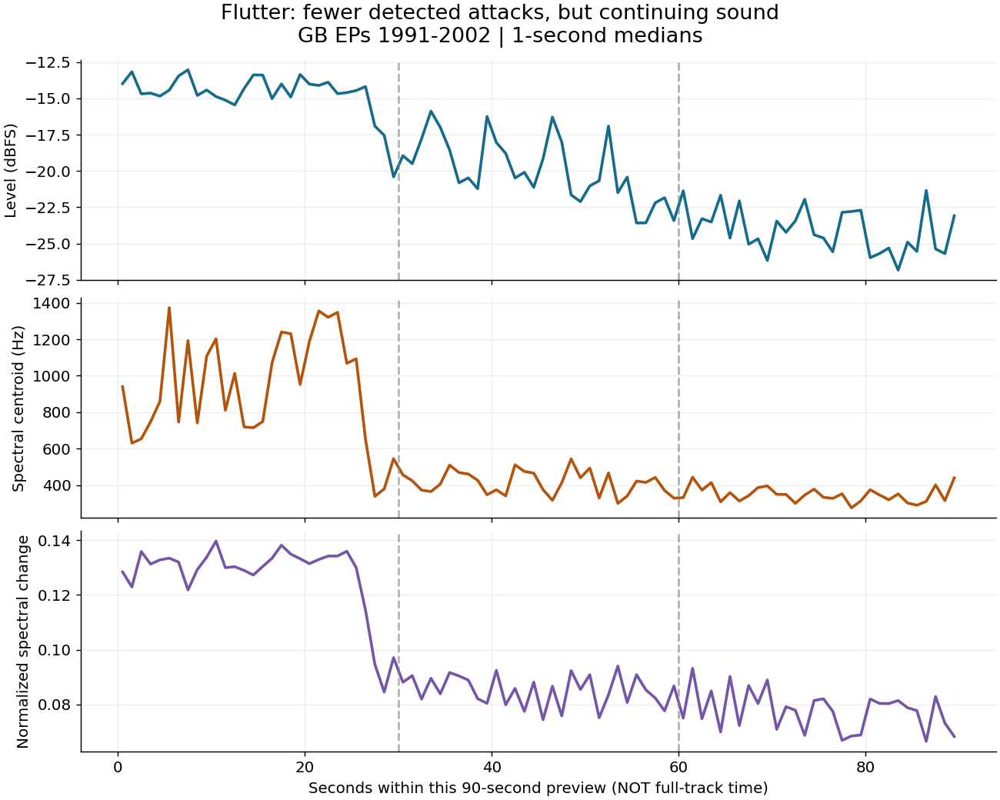

# Flutter：後半の打点は本当に消えるのか

2026-10-02 JST。GB EPs 1991–2002の公式90秒previewを再取得し、旧SHA-256 `ab5d3f767f96e3d62e4abd494654e75974f2579542e113ae8fc0a20d59ebc751` と一致。音源本体はGitに含めない。作品同定は既存Apple catalog ID 420210312、ISRC GBBPW9400118に基づく。今回はcatalog再検索ではなく、固定済み音源の再解析。

上から音量、周波数の重心、音量を正規化したスペクトル形状の変化量。横軸はpreview内時刻。全曲内の時刻ではない。線は1秒ごとの中央値、点線は集計境界であり、曲の構造境界の同定ではない。

## 実測

| preview内 | 0–30秒 | 30–60秒 | 60–約90秒 |
|---|---:|---:|---:|
| 音量中央値（dBFS） | -14.55 | -20.19 | -24.19 |
| 周波数重心中央値（Hz） | 854.2 | 411.5 | 342.0 |
| 正規化スペクトル変化の中央値 | 0.1287 | 0.0856 | 0.0777 |
| 全体共通の検出基準：打点候補数 | 275 | 47 | 18 |
| 区間別の検出基準：打点候補数 | 195 | 102 | 93 |

全体共通の基準では旧記録の275→47→18を再現した。各区間内の中央値・MADに基準を合わせ直すと195→102→93となる。最初と最後の区間の候補数減少は約93%から約52%へ変わる。従って候補数の減少幅には検出基準が強く影響する。後半の候補を「実際の音符が18個しかない」「ほぼ打点が消滅する」と読むことは支持できない。局所基準も正解の音符数ではなく、相対的な突出を拾う別条件である。

旧数値を消さず、その意味を限定する。周波数重心の先頭窓は旧1141.8ではなく、EPs旧記録852.2に対して今回854.2。フレーム中央時刻による窓割り等の境界差を含むため完全一致とはしない。

## 音楽について何が言えるか

この区間では、音量が下がるのと並行して高域寄りの成分と短時間のスペクトル変化が減る。全体が単に同じ音のまま一定倍率で小さくなるだけなら、正規化スペクトル形状は変わらない。その意味で単純な一様音量減衰だけでは今回の三指標を説明できない。

ただし、時間変化する音量、残響、ノイズ、音色変化、声部の撤去のどれがどれだけ寄与するかは未分離。打点が持続音へ置換されたこと、特定声部が消えたこと、演奏操作の因果はまだ証明していない。図の約25–30秒に集中する変化は次の詳細確認候補であり、確定した編集点・小節境界ではない。

## 再現と利用境界

`python analyze.py INPUT.m4a OUTPUT_DIRECTORY`。入力hash不一致は停止。ffmpegでmono 22050 Hz float32へ全区間復号。2048 sample Hann窓、256 hop。スペクトル重心はpower加重。fluxはL1正規化magnitudeの正方向差。peakは中央値+2MAD、prominence MAD、間隔55 ms以上。局所条件は各30秒で基準を再計算するため、境界でのprominenceも変わりうる。条件変更を音符数の正解判定に使わない。

取得URL、bytes、環境、数値、条件はresults.json、再実行コードはanalyze.py。公開Apple previewの固定済みURLのみを使用し、認証情報・有料購入・全曲抽出は行っていない。既存preview結果を置換せず追加比較とする。全曲内offset・全曲hash・AE_LIVE比較・聴取者評価は未取得。製品コードとintegrationは未変更。

## 前回報告の表記訂正

前回チャットの短縮hash `96f0c350…53bb2` は末尾の誤記。正しくは `96f0c350…cf9d7f`。保存済み数値監査の完全なSHA-256は正しい。また前回sources.jsonのJ Dilla commit文字列は誤記で、前回実取得ログの正しい値は `164ad01ae1e06d4838da17661ee9ce9bf0e36c7a`。過去checkpointは履歴として保持し、この訂正を付す。
